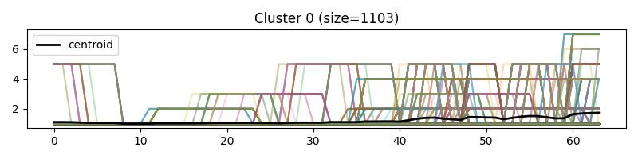
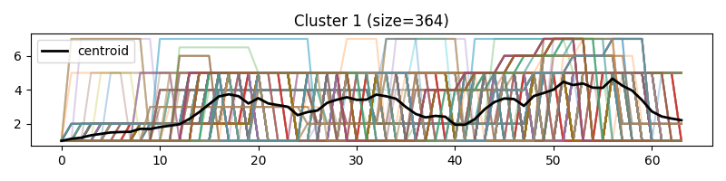
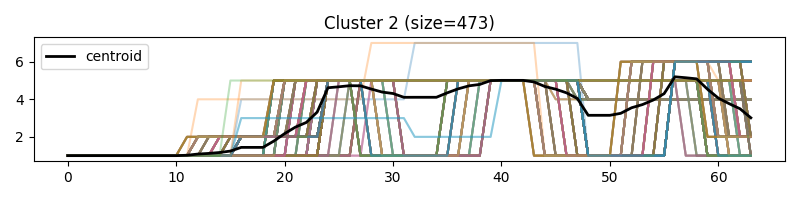

---
title: 'MuseLang: a simple descriptive representation of music '
pubDate: '2024-12-20'
---
MuseLang is a structured, musically-aware language designed to describe music in an intuitive, expressive, and machine-interpretable way. Its usefulness and potential for LLM applications include:
- Improved Music Understanding: MuseLang provides a symbolic representation that captures note-level, harmonic, and rhythmic structures, enabling LLMs to better comprehend and reason about musical content.
- Interpretable Generation: It enables LLMs to generate music in a format that’s easy to read and analyze, facilitating human-in-the-loop editing and music education use cases.
- Compositional Control: By offering structured abstractions like phrases, chords, and motifs, MuseLang empowers LLMs to generate coherent musical forms with higher-level control, bridging symbolic and natural language modeling.
- Cross-Modality Potential: Its symbolic format makes it suitable for alignment with lyrics, gestures, or visuals in multi-modal LLM applications, such as music-video synthesis or expressive performance modeling.
- Data Efficiency: Compared to raw MIDI or audio tokens, MuseLang can reduce sequence length and enhance learning by abstracting redundant low-level events into higher-order structures.

In summary, MuseLang offers an interpretable, compact, and musically-informed bridge between natural language and symbolic music, making it a powerful interface for LLM-based music analysis, composition, and interaction.

### Pitch Representation
Each pitch is referred to using the standard letter notation (A-G) followed by an accidental (sharp or flat, if applicable) and octave number. This aligns with both Western musical notation and MIDI numbering systems, ensuring clarity regarding the register and exact pitch. When consecutive notes are played simultaneously, implying a chord or harmonic structure, they are listed together without further elaboration on chordal quality or function, as this language focuses on simplicity rather than harmonic analysis.

###  Rhythm and Duration
Durations are expressed in terms of beat lengths (e.g., 0.5 for half a beat, 1.0 for a full beat, etc.). The relative brevity or length of notes is described succinctly, with an emphasis on when notes are sustained or played in rapid succession.
Triplets: When three notes are played in a group within the same temporal space as two notes, the term “triplet” is explicitly used. This choice of language emphasizes the rhythmic grouping without requiring the user to infer it from the numeric durations.
Syncopation: For sections where notes are placed off the main beats or emphasize weaker parts of the measure, the language refers to “syncopation” or uses terms like “alternating” to indicate a rhythmic shift or irregular pattern.

###  Repetition and Patterns

When a sequence of pitches and durations repeats across measures, the description explicitly refers to this repetition (e.g., “identical to Measure 1”) rather than restating the entire sequence. This emphasizes the structural coherence of the piece without redundancy.For extended repeating patterns, the term “steady rhythm” or “triplet rhythm” is used, indicating that a regular, repeated figure occurs throughout the measure.

###  Held or Sustained Notes

Sustained notes are indicated by specifying how long they are held (e.g., “held for 3 beats”), and in some cases, the word “sustained” is used to reinforce the idea of a continuous tone. For lower voices or parts that support harmonic foundations, sustained notes are often described alongside the duration of chords, creating a clear distinction between active melodic lines and static harmonic underpinnings.

###  Harmonic Context

When simultaneous pitches form chords, they are described without the use of chord names (e.g., “a chord of C#3 and C#2”). This approach is adopted to maintain the focus on individual note values and pitches rather than functional harmonic theory.
However, the harmonic role is implied through the mention of lower sustained notes in the second part of the measure, creating a clear differentiation between melody and accompaniment.

###  Tempo and Flow

Although tempo is not directly specified in the numeric durations, the recurring mention of note values like “0.5 beats” or “3 beats” conveys the relative pace of the music. Faster or more active sections are described with phrases like “syncopated rhythms” or “faster alternations,” while slower, more lyrical passages employ terms such as “sustained” or “held.”

###  Structural Elements

The description avoids deep technical terms related to form (e.g., binary, ternary), but structural relationships between measures (such as repetitions or variations) are noted. For sections of the music that repeat entire phrases, the language employs formal terms like “repeats” or “returns to,” helping the reader grasp the overarching structure without needing to reanalyze each note.

###  Overall Clarity and Simplicity

The language is designed to be precise without becoming too dense. While certain terms like “triplet,” “syncopation,” or “held note” provide specificity, the absence of complex harmonic or formal terminology ensures accessibility.
Each measure is broken into clear segments (Part 1 and Part 2), making it easy to distinguish between different musical voices or lines.

---

