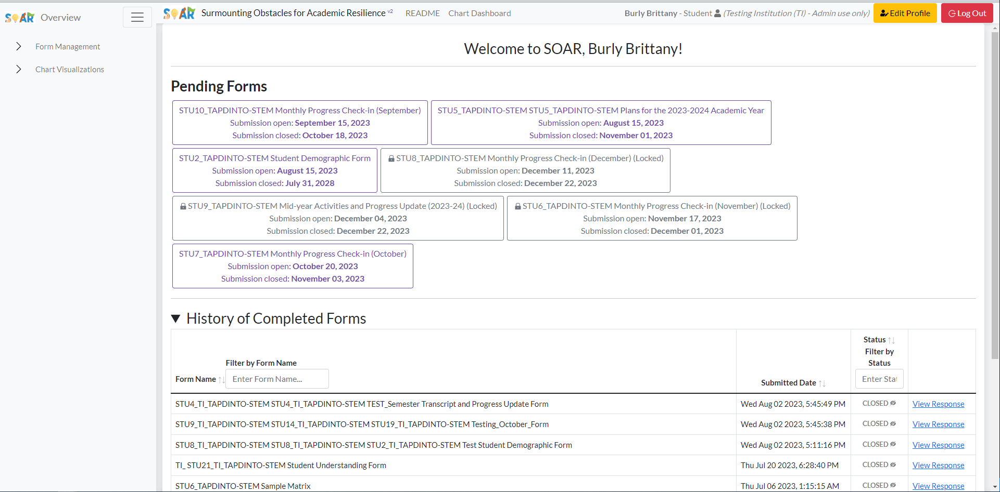
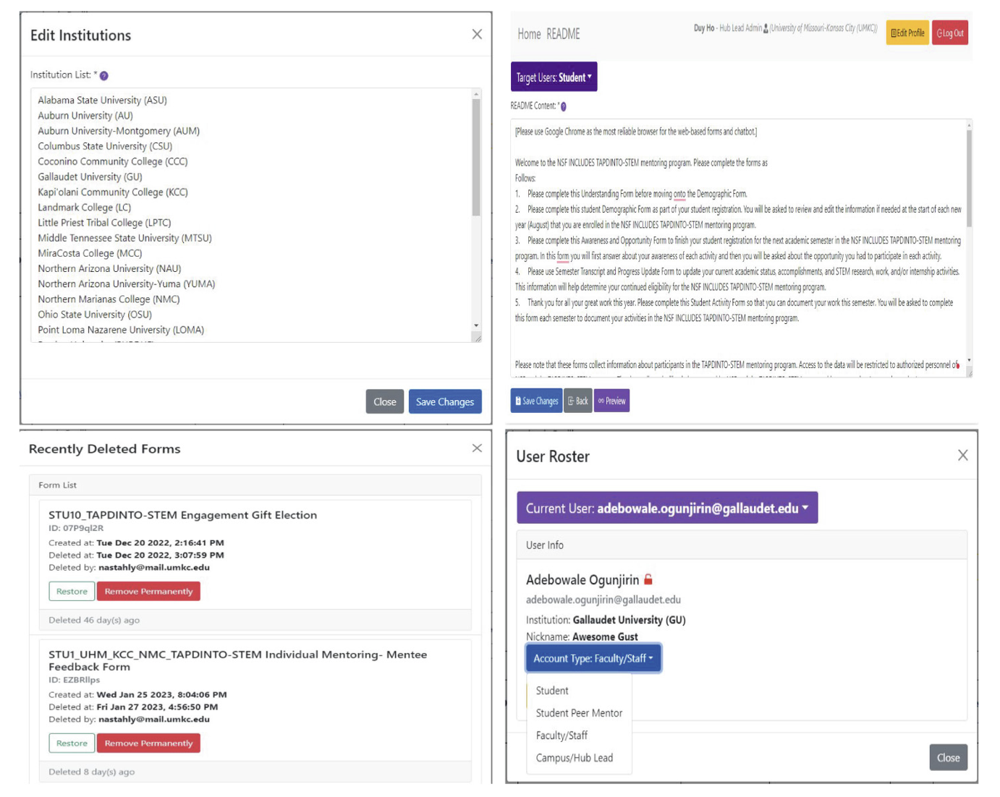
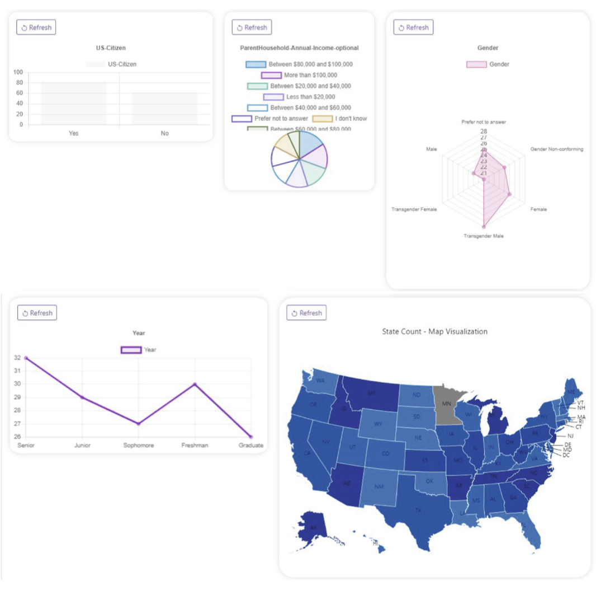

[The SOAR Portal](https://soar-ai.com/) is a tailored platform designed to foster collective impact and systemic change for post-secondary students with disabilities. Throughout the academic year, periodic questionnaires will appear on users' dashboards. These questionnaires gather data on individual profiles, goals, activities, and advancements. By analyzing this information, the platform aims to monitor both the challenges and achievements of students, enhancing mentorship programs, amplifying communication concerning alliance objectives, and distributing relevant resources.

---

---

