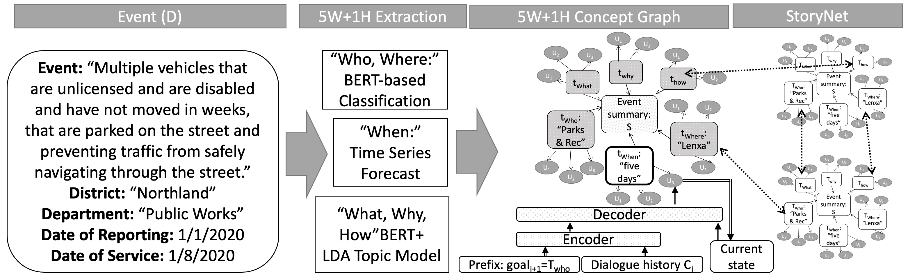
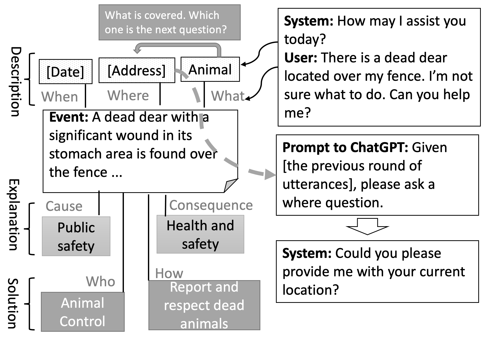
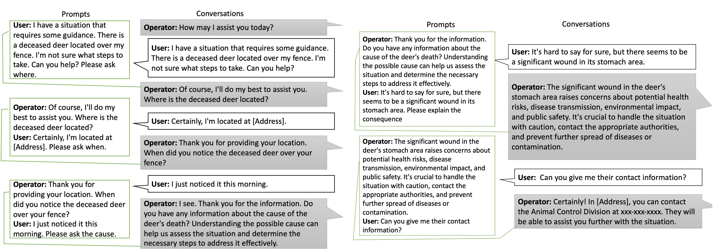

StoryNet, a new framework in Explainable Artificial Intelligence (XAI) that leverages Large Language Models to extract and link the 5W1H elements (Who, What, When, Where, Why, and How) within stories. By organizing information into interconnected narratives, StoryNet addresses the limitations of traditional dialogue-based explainability—such as lack of context and error propagation—and offers richer, more intuitive explanations. Uniquely, StoryNet can predict future goals by dynamically navigating through these narrative structures, which is particularly valuable for predictive analytics and decision-making tasks. Empirical evaluations on a 311 call dataset show that StoryNet outperforms existing BERT-based models and even ChatGPT (when used without StoryNet) in both narrative goal prediction and delivering informative, engaging multi-turn conversations. Overall, StoryNet represents a transformative advance in XAI by bridging the gap between AI systems and human users through narrative-driven, interactive explanations.

---

---
## Ref

- Sébastien Bubeck, Varun Chandrasekaran, Ronen Eldan, Johannes Gehrke, Eric Horvitz, Ece Kamar,Peter Lee, Yin Tat Lee, Yuanzhi Li, Scott Lundberg, et al. 2023. Sparks of artificial general intelligence: Early experiments with gpt-4. arXiv preprint arXiv:2303.12712.549
- Chaotao Chen, Jinhua Peng, Fan Wang, Jun Xu, and Hua Wu. 2019. Generating multiple diverse responses with multi-mapping and posterior mapping selection. arXiv preprint arXiv:1906.01781.553
Deyao Zhu, Jun Chen, Xiaoqian Shen, Xiang Li, and Mohamed Elhoseiny. 2023. Minigpt-4: Enhancing vision-language understanding with advanced large language models. arXiv preprint arXiv:2304.10592. 
